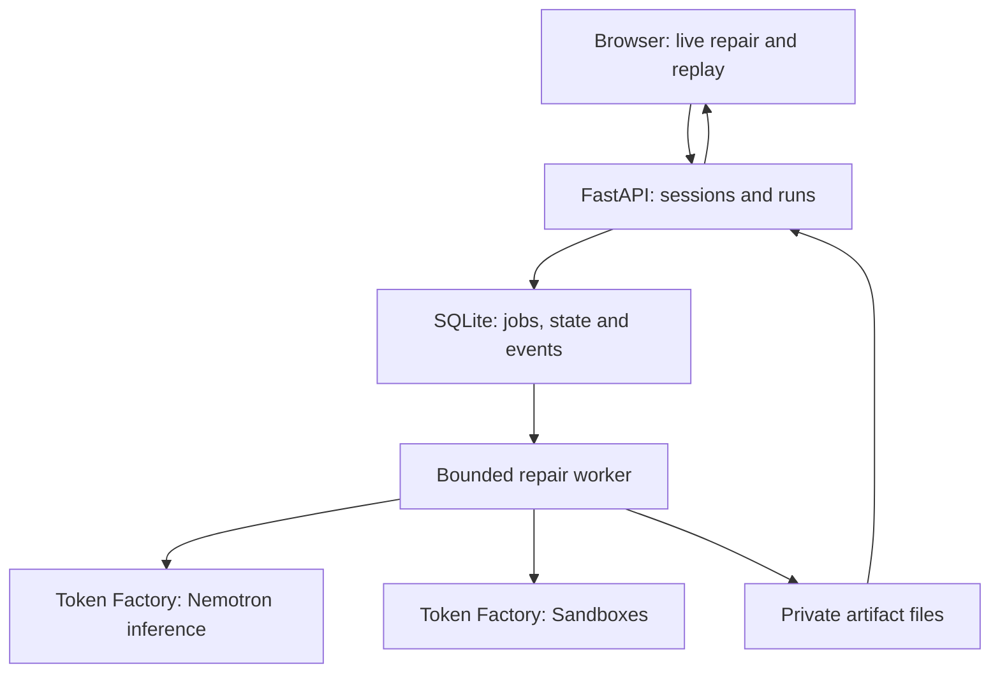

# RepoMedic — Architecture

Version 0.4 · 2026-10-09 · Design specification, not implemented behavior.

## 1. Chosen architecture

A modular monolith on one HTTPS host: static frontend, FastAPI API, one worker process, SQLite on persistent disk and a private artifact directory. NVIDIA Nemotron inference and repository execution both use Nebius Token Factory services. Application hosting need not move to Nebius merely to qualify; the real Token Factory runtime integration is explicit.



No distributed queue or vector database. API and worker use independent SQLite connections with WAL, busy timeouts and short transactions. Never hold a DB transaction during remote calls. One worker owns execution; an atomic claim/heartbeat protects restart recovery. Increase infrastructure only after measured contention.

## 2. Auth, database and S3 decisions

| Item | Required now? | Implementation |
|---|---|---|
| Nebius authentication | Yes | Server-side inference and sandbox credentials/config; confirm account scopes |
| App authentication | Lightweight live-only | Access code exchanged for opaque session cookie |
| Account registration/GitHub OAuth | No | Public curated repos; no private repo access or automated writes |
| Database | Yes | SQLite WAL on persistent volume |
| Durable artifacts | Yes | Private local directory with hashes and authenticated downloads |
| S3 | No | Optional backup/export once core works; not required for Sandboxes |
| PostgreSQL | No | Migration option for multiple hosts or sustained concurrency |
| Redis/Celery | No | SQLite jobs plus one worker loop |

Separate public and judge access codes if quotas differ. Store high-entropy codes as hashes; compare safely and throttle failed exchanges. Issue a random session token, store only its hash, set HttpOnly/Secure/SameSite cookies, expiration and explicit revoke support. Use same-origin hosting; enforce Origin/CSRF controls on mutations. Native EventSource uses the session cookie; never put credentials in an SSE URL. Every summary/event/cancel/artifact endpoint checks session ownership. A run UUID is not authorization.

Supply judge credentials in testing instructions before submission. General-public quotas may protect credits but must not prevent judges testing advertised behavior. Replay/evaluation datasets published intentionally are separate public resources.

## 3. Token Factory integration

The console URL `https://tokenfactory.nebius.com/` is not the inference API base URL. Configure endpoints from the account's current examples. The public cookbook currently shows a regional OpenAI-compatible endpoint; the ConTree client documentation shows a separate sandbox endpoint. Do not infer one from the other.

Internal configuration names (RepoMedic-owned, not necessarily SDK-native):

```dotenv
NEBIUS_API_KEY=server-only
NEBIUS_BASE_URL=copy-from-account-examples
NEBIUS_MODEL_ID=confirmed-nemotron-model-id
SANDBOX_API_KEY=server-only-if-separate
SANDBOX_BASE_URL=copy-from-current-sandbox-docs
SANDBOX_PROJECT_ID=if-required-by-account
DATABASE_PATH=/var/lib/repomedic/repomedic.sqlite3
ARTIFACT_ROOT=/var/lib/repomedic/artifacts
APP_ACCESS_CODE_HASH=generated-hash
JUDGE_ACCESS_CODE_HASH=generated-hash
MAX_ACTIVE_RUNS=1
MAX_PARALLEL_BRANCHES=3
RUN_DEADLINE_SECONDS=600
```

Validate required configuration at startup. Pin library versions and record the installed versions in evidence. Do not blindly hardcode model IDs, rate limits, token caps, costs, credit expiry or service availability from old documents.

Use one model initially. If added, Nano summarizes logs and Ultra provides optional review; measure their latency/quality benefit. All primary benchmark arms have the same model assignment, settings, context builder and optional review. Truncated responses cannot become valid patches. Context budget includes output/reasoning allowance; log usage, truncation and unsupported parameters. Retain raw logs as artifacts and provide focused traceback/source hunks to the model. No provider failover in the headline experiment.

## 4. Sandbox adapter boundary

Define these as internal methods, not asserted ConTree SDK names:

| Method | Internal responsibility |
|---|---|
| `prepare(recipe)` | Produce pinned baseline/upgraded checkpoint references |
| `run(checkpoint, command_spec)` | Submit tracked operation; return operation ID |
| `inspect(operation_id)` | Read authoritative status/output/checkpoint |
| `fork(checkpoint)` | Obtain independent execution state |
| `apply_patch(checkpoint, patch)` | Validate/upload patch and produce next state |
| `cancel(operation_id)` | Request cancellation and confirm terminal status |
| `export(checkpoint, approved_paths)` | Retrieve bounded outputs |
| `release(resources)` | Apply documented lifecycle/cleanup operations |

Map these to real pinned client calls only after the spike. ConTree describes filesystem checkpoints; do not assume live Python processes, sockets or memory are preserved. Each test operation launches afresh. Parallel runs must derive independently from a shared checkpoint, not mutate a shared session's active pointer.

Track operation IDs in SQLite immediately. For ambiguous submission timeout, reconcile via provider-supported identifiers/status before retrying. If no reliable lookup exists, mark uncertain and wait/escalate; never blindly duplicate execution. Cancellation/restart cannot accept stale late results. Check remote status before releasing tracked resources; document snapshots that persist and their retention/cost.

## 5. Task recipe

One immutable versioned record per supported environment:

```json
{
  "task_id": "demo_001",
  "recipe_version": "1",
  "repo_url": "https://github.com/OWNER/REPO",
  "repo_commit": "PINNED_SHA",
  "python_version": "PINNED_SUPPORTED_VERSION",
  "base_image_digest": "PINNED_DIGEST",
  "package": "TARGET_DISTRIBUTION",
  "from_version": "EXACT_OLD_VERSION",
  "to_version": "EXACT_NEW_VERSION",
  "allowed_source_paths": ["src/"],
  "protected_paths": ["tests/", "conftest.py", "pytest.ini"],
  "environment_lock_artifact": "locks/demo_001.json",
  "test_command_id": "pytest_full_suite",
  "max_test_seconds": 120
}
```

Placeholders above are a schema illustration, not a runnable task. Include baseline and upgraded full dependency lock/snapshot, runner version/plugin list, install procedure, nondefault fixtures and expected test outcomes in the real record. Operators define commands as structured argument arrays; public callers cannot supply shell commands or filesystem paths.

Trusted preparation manages permitted manifest/lock changes required for the requested bump. Agent patches normally edit source only; distinguish these trusted dependency changes from forbidden test-runner changes in the same `pyproject.toml`. Do not blanket-reject the manifest that legitimately carries the upgrade.

## 6. Repair lifecycle

1. API validates task/session/budget and idempotently creates a queued run.
2. Worker claims it and prepares an environment from the pinned recipe.
3. Run baseline twice; persist collection/outcome manifest. Unstable tasks abort rather than silently dropping tests.
4. Apply trusted dependency bump; inspect installed version and import provenance, capture full environment and reproduce failure.
5. Diagnose with logs and relevant source; produce distinct complete-task strategies.
6. Generate restricted diffs in independent checkpoints. Record each call, patch and operation.
7. Run preserved verification checks during search; retain candidates under frozen search policy.
8. Refine promising candidates using actual failure feedback and remaining budgets.
9. Reapply a candidate in a fresh upgraded verification environment. Execute all hard gates.
10. Optionally review; select eligible result and transactionally finalize its evidence and terminal status.

If no patch qualifies, return failure/partial evidence. A partial result is not a successful repair. No-breakage tasks are excluded from repair solve counts.

## 7. Verification trust boundary

The host controls recipe, protected hashes, expected collection and acceptance policy. The model controls only proposed source edits. Repository files/comments/logs are untrusted model inputs.

Checks:

- Parse unified diff; deny path traversal, outside-tree edits, symlink escapes, protected file changes and unapproved executable artifacts.
- Fresh upgraded environment; no inherited installed-package or shell-state mutations from search.
- Verify distribution/version/import path and preserved dependency lock. Restrict compatibility shims according to the documented task policy.
- Restore tests/fixtures/runner configuration from trusted reference; hashes before/after.
- Persist expected collected test IDs, outcome expectations and runner/plugin versions; compare candidate results.
- Require full test completion, nonzero intended coverage, correct process status, no collection errors or new skips/xfails.
- Cross-check provider execution status, process exit and bounded test artifacts. Keep verdict construction outside the candidate repository.

Candidate Python can still interfere with test behavior or fabricate output inside its VM. Fresh execution and external checks reduce obvious shortcuts; they do not create an adversarially tamper-proof oracle. State this limitation. No LLM can waive the hard gates. Independent behavioral checks, when available, add confidence and must be equally applied across arms.

## 8. State, persistence and recovery

SQLite is authoritative. JSONL is a derived replay/export, not a second source of truth. Append run-state transition and associated event in the same transaction.

Tables:

| Table | Important fields |
|---|---|
| sessions | id, token_hash, access_class, expires_at, revoked_at |
| runs | id, session_id, task_id, recipe_version, state, reason, request_hash, idempotency_key, budgets, cancel_requested, lease_owner, lease_expiry |
| branches | id, run_id, parent_id, strategy, round, state, checkpoint_ref, diff_hash, gate_result |
| operations | id, run_id, branch_id, provider_operation_id, submission_state, checkpoint_ref, status, timestamps |
| model_calls | id, run_id, branch_id, model_id, parameters_hash, usage, estimated_cost, latency, status |
| events | run_id, seq, type, payload_json, timestamp; unique(run_id, seq) |
| artifacts | id, run_id, relative_path, sha256, byte_size, mime_type, retention_class |

Unique(session_id, idempotency_key); reusing a key with another payload returns 409. Artifact writes use temporary file + atomic rename + hash; register only completed files. On startup reconcile incomplete writes and tracked remote operations. Missing terminal artifact => explicit integrity error, not success.

Worker recovery is bounded: recheck cancellation/deadline, inspect existing operations, resume only verified transitions, and fail clearly on unrecoverable state. Do not call JSONL append-only logging “durable execution” without this behavior.

## 9. API contract

| Method | Endpoint | Access/result |
|---|---|---|
| POST | `/api/session` | Code exchange; secure session cookie |
| DELETE | `/api/session` | Revoke current session |
| GET | `/api/tasks` | Curated task metadata; no secrets |
| POST | `/api/runs` | Session; body below; Idempotency-Key; 202 |
| GET | `/api/runs/{id}` | Owner; current summary |
| GET | `/api/runs/{id}/events` | Owner; SSE and Last-Event-ID |
| POST | `/api/runs/{id}/cancel` | Owner; idempotent cancellation request |
| GET | `/api/runs/{id}/artifacts/{artifact_id}` | Owner; safe streamed download |
| GET | `/api/replays` | Public frozen metadata |
| GET | `/api/eval/summary` | Public frozen methodology/results |
| GET | `/api/health` | Minimal public readiness; no credentials/account balances |

```json
{"task_id":"demo_001","search_mode":"branch_refine"}
```

Server determines K, limits and commands for public jobs. CLI/evaluation configurations may expose controlled search parameters. Unsupported requests return 422; no ownership returns 404; expired session 401; admission limit 429; platform unavailable 503.

SSE envelope:

```json
{"run_id":"UUID","seq":12,"ts":"UTC_TIMESTAMP","type":"candidate_tested","payload":{"branch_id":"b2","failed":3,"verification_status":"partial"}}
```

Events: `run_queued`, `run_state_changed`, `baseline_checked`, `upgrade_checked`, `strategies_planned`, `branch_created`, `patch_generated`, `patch_rejected`, `candidate_tested`, `branch_refined`, `verification_completed`, `model_call_completed`, `budget_updated`, `artifact_created`, `run_terminal`.

Validate payloads through shared schemas; derive frontend types. SSE event `id` is seq. Reconnect queries committed events after cursor; duplicates are ignored client-side. The summary endpoint handles reconnect/restart even if the stream fails. Terminal events include explicit state/reason and artifact IDs.

## 10. Security and deployment

Only allowlisted curated repositories and installation recipes in public mode. No host Docker socket, SSH keys, cloud instance credentials or Nebius keys in sandbox. Use sandbox resource limits and supported network controls; verify egress restrictions instead of assuming VM isolation prevents network abuse. Curated-only stays mandatory if controls are inadequate.

The API host never executes repository setup/code. Sanitize/render logs and diffs as text; escape repository-controlled HTML. Reject oversized artifacts and archive traversal. Audit cancellations, access failures and budget denial without recording secrets.

Serve frontend and API behind one HTTPS reverse proxy. Mount DB/artifact volume into application containers. Back up SQLite with its supported backup mechanism plus referenced artifacts; do not copy a live WAL database file blindly. Local backup protects accidental changes, not whole-host loss; an optional external object-storage backup can address that later if affordable. Freeze public demonstration evidence in the repository when licenses allow and secrets are absent.

S3 is an optional storage adapter: private bucket, server IAM role, checksums and scoped downloads. Never use public buckets by default. Do not add S3, PostgreSQL or OAuth just to decorate the architecture.

## 11. Meaningful verification checks to implement

Exercise end-to-end repair, dependency downgrade rejection, new skip/collection change rejection, unauthorized read/cancel/download, duplicate create, timeout reconciliation, cancel-late-result barrier, restart recovery, SSE reconnect and full resource cleanup. Tests must exercise externally observable behavior, not mirror helper implementations.

## 12. Sources

Checked 2026-10-09: [Token Factory cookbook](https://github.com/nebius/token-factory-cookbook), [Nemotron example](https://github.com/nebius/token-factory-cookbook/blob/main/models/nemotron/nemotron3-super-120B.md), [ConTree SDK and client configuration](https://github.com/nebius/contree-sdk), [ConTree CLI](https://github.com/nebius/contree-cli), [official hackathon rules](https://nebiusglobalaihackathon.devpost.com/rules).

Endpoint examples are documentary evidence only; the integration and quotas must be tested on your account.
